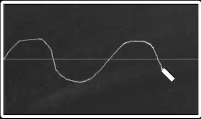
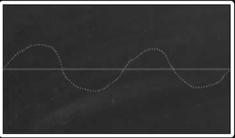
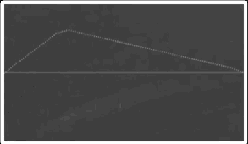
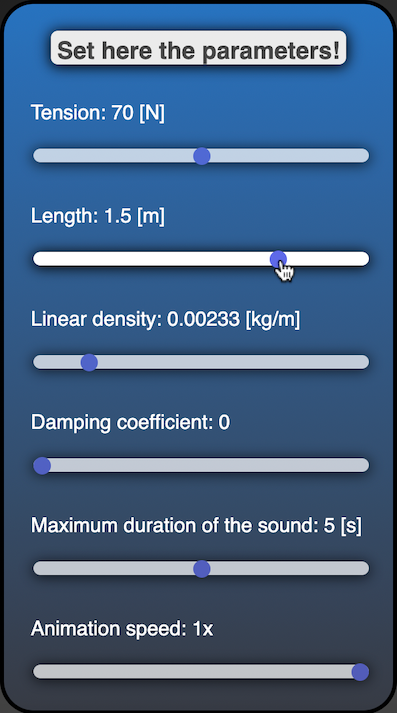
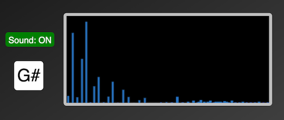

# String Simulator
## Web-based Simulator of transversed vibrations of a stretched String fixed at both ends with a user defined initial shape and arbitrary boundary conditions

## Introduction
As a project for the Advanced Coding Tools and Methodologies course we decided to develope a web-based didactic tool, which emulates the vibrations of a string fixed at both ends, with an initial shape drawn by the user. Furthermore, the user can define all possible boundary and environmental conditions, as well as the parameters that characterize the vibrating string. It is then possible to hear the sound emitted by the string, and see it's frequency spectrum. 

## User Interface

### Blackboard

The first thing the user must do, is draw on the blackboard the initial shape of the string before it begins to vibrate. Of course, the vertical position of the ends of the string has to be null, so wherever the user starts and stops to draw, the inital and final vertical position of the drawing are forced to be null. This means that if the user starts drawing, for example, in the middle of the blackboard, automatically a straight line will appear from the first (default) point to that point drawn by the user, and a similar mechanism it's set also for the last point, in order to maintain always these two positions fixed. Our application tracks the mouse coordinates that the user encounter while he's drawing. As a reference for the rest position of the string, a horizontal line helps guide the user.

After the drawing is concluded, the string shape is discretized, so that it can be treated as a set of point masses. Each one of the point masses' vibrations is, then, calculated as the linear combination of it's proper frequencies and modeshapes. Due to some inaccuracies of mouse tracking, for discretization we also use a line-interpolation library: every shape string is always discretized with 120 points.

We want to focus your attenction on one simple fact: each mass composing the string is totally unrelated to the others. The final vibration of the string as a whole body is a simple consequence of the applyed vibroacoustical theory.

When the user clicks on the **Animate** button, the string then starts to vibrate. 

The vibration will continue ad libitum, so if the user wants to clear the blackboard and start to draw another string shape all he must do is click on the **Reset** button.

### Parameters

Before clicking on the **Animate** button, the user can configure the external parameters:

* **Tension**: Controls the tension applied to both ends of the string.
* **Length**: Controls the length of the string in it's rest position.
* **Linear density**: Controls the mass of the string per volume unit.
* **Damping coefficient**: Controls the desired amount of friction the string undergoes in an eventual medium.  
* **Maximum duration of the sound**: Sound reproduction starts with the vibration. This parameter controls the maximum duration, in seconds, of the sound reproduced. 
* **Animation speed**: Allows to control the velocity of the vibration, if the user wants to see it in slow motion. Of course, if the Animation speed is not set to 1x, the sound reproduction will not be simoultaneous to the vibration.

### Pick-up

The sound buffer, in order to be played, needs an external source to take it's data from. For this reason, we decided to emulate the sound reproduction taking cue from the mechanism of sound reproduction of an electric guitar. Therefore, is possible for the user to set a position on the horizontal axis, using the slider right below the blackboard, so that the reproduced sound will be the one radiated from the vibrating mass in the position corresponding to the chosen one, simulating the role of a pickup on the electric guitar. 

### Spectrum analyzer and Note Detector

In order for the user to decide if he wants the sound to be played, there is a **Sound: ON/Sound: OFF** switch, which gives the user this choice.

When the animation of the vibration starts, it's frequency spectrum is immediately visualized on the Spectrum analyzer screen. More precisely, the analyzed spectrum is the one of the sound radiated by the mass corresponding to the pickup position.

Furthermore, on the white square is visualized the note which comes closest to the palying sound pitch, found using equal temperament. 

## Vibroacoustical analysis

We start considering the string's equation, subject to damping:

where μ is the linear density of the string, T is the tension applied to the string, and β is the damping coefficient.

We assume a standing wave solution of the form w(x,t) = Φ(x)G(t)

From the boundary conditions we find out that

With i=1,2,...,N    where N is the number of considered modes

* If  0">, then 

    
* If , then 

    
    
with  and 

Therfore, it's possible to get the solution of the equation in the form:

 \frac{\beta L}{2 \pi \sqrt{T \mu}}} sin(\frac{i \pi x}{L})(a_i cos(\omega_i t) %2B b_i sin(\omega_i t))">

The parameters ai and bi are determined by imposing the initial conditions:

