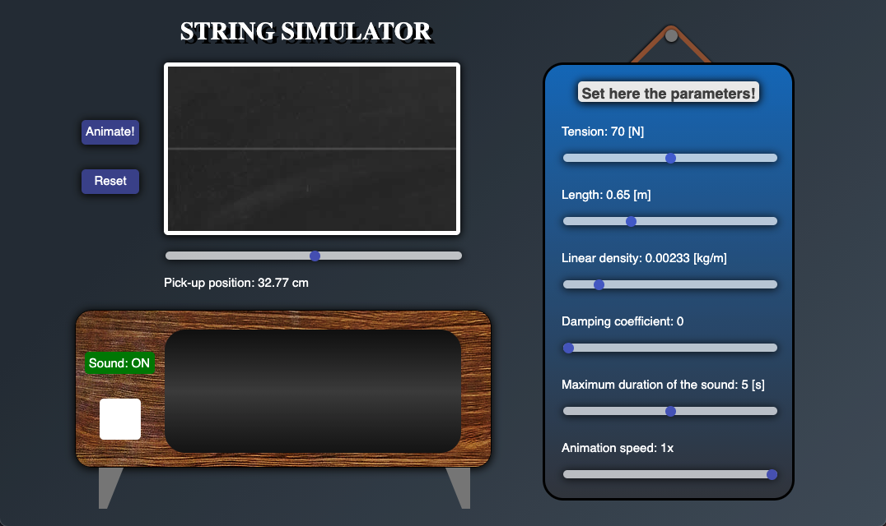
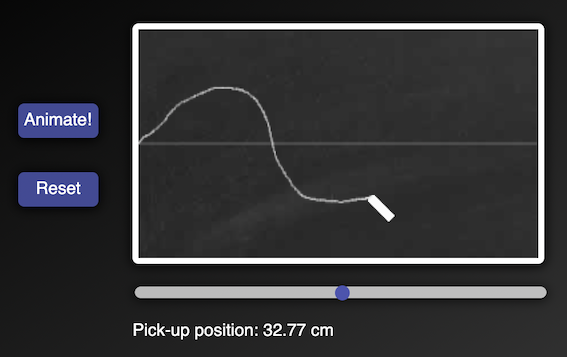

# String Simulator
## Web-based Simulator of transversed vibration of a stretched String fixed at both ends with a user defined initial shape and arbitrary boundary conditions

## Introduction

## User Interface

### Blackboard

### Parameters

### Spectrum analyzer and Note Detector

### Pick-up

## Vibroacoustical analysis

