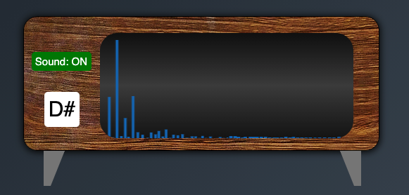

# String Simulator
## Web-based Simulator of transversed vibration of a stretched String fixed at both ends with a user defined initial shape and arbitrary boundary conditions

## Introduction
As a project for the Advanced Coding Tools and Methodologies course we decided to develope a web-based didactic tool, which emulates the vibration of a string fixed at both ends, with an initial shape drawn by the user. Furthermore, the user can define all the possible boundary and environmental conditions, and the parameters that characterize the vibrating string. Then, it's possible to here the sound emitted by the string, and to see it's frequency spectrum. 

## User Interface

### Blackboard

The first think the user wants to do, is to draw down on the blackboard the initial shape of the string before it begins to vibrate. Of course, the vertical position of the ends of the string has to be null, so wherever the user starts and stops to draw, the inital and final vertical position of the drawing are forced to be null. As a reference for the rest position of the string, there is an horizontal line which guides the user.

After the drawing is concluded, the string shape is discretized, so it can be treated as a set of masses. Each one of the masses' vibrations is, then, the linear combination of it's proper frequencies and it's modeshapes.

We want to focus your attenction on one simple fact: each mass composing the string is totally unrelated to the others. The final vibration of the string as a whole body is a simple consequence of the applyed vibroacoustical theory.

Then, when the user clicks on the **Animate** button, the string starts to vibrate. 

The vibration will continue ad libitum, so if the user wants to clear the blackboard and start to draw another string shape he has just to click on the **Reset** button.

### Parameters

Before to click the **Animate** button, the user can set it's own desired external parameters configuration. Here the explanation of each customizable parameter:

* **Tension**: Controls the tension applied to the ends of the string.
* **Length**: Controls the length of the string in it's rest position.
* **Linear density**: Controls the mass of the string per volume unit.
* **Damping coefficient**: Controls the desired amount of friction the string undergoes with a potential fluid.  
* **Maximum duration of the sound**: The sound reproduction starts with the vibration, so this parameter controls the maximum duration, in seconds, of the sound reproduced. 
* **Animation speed**: Allows to control the velocity of the vibration, if the user wants to see it in slow motion. Of course, if the Animation speed is not set to 1x, the sound reproduction will not be simoultaneous to the vibration.

### Spectrum analyzer and Note Detector

### Pick-up

## Vibroacoustical analysis

